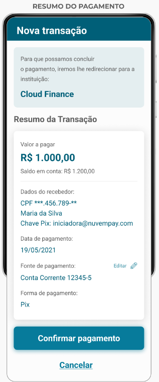
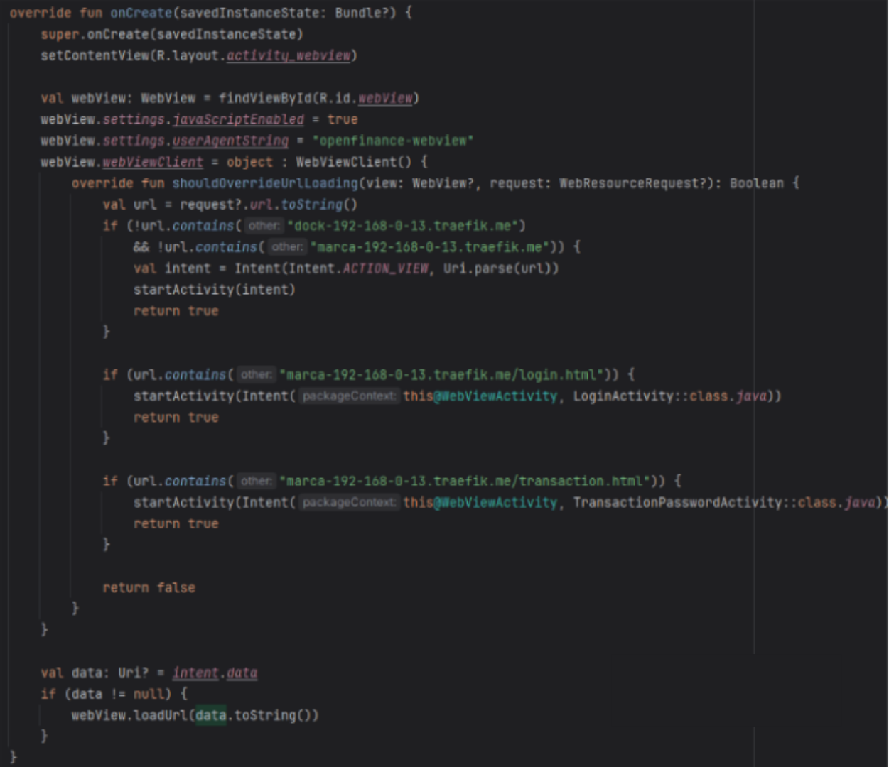

<!-- ⚠ CONTEÚDO IMPORTADO da Documentation (2 fonte(s)). Revisar/curar links, imagens e referências a swagger-ui. -->
> 🔧 **A consolidar:** este conteúdo veio de várias páginas. Unificar e remover repetições.


<!-- ┄┄ origem: docs/pt-br/openFinance/opusOpenFinance/consentimentoCompartilhado/detentorContasETransmissaoDados.md ┄┄ -->

## Introdução

Esta página foi elaborada para apoiar usuários que estão utilizando a ferramenta pela primeira vez. Aqui, é possível encontrar instruções passo a passo que tornarão o uso do software mais simples, intuitivo e eficiente, ajudando a explorar todo o seu potencial desde o início, e entender o funcionamento da solução.

---

## Itens resolvidos pela nossa solução

Aqui estão os principais elementos que nossa solução oferece:

- **Exibição e confirmação do consentimento:** A confirmação faz parte da solução, minimizando o esforço técnico;

- **Tela de Handoff:** A tela de Handoff já está implementada na nossa solução, poupando esse esforço caso você, cliente, só possua uma solução app;

- **Área de gestão completa:** Nossa solução inclui um painel centralizado para a gestão dos consentimentos, pagamentos e vínculos;

- **Listagem e detalhes dos consentimentos:** Os consentimentos transmitidos são listados, com detalhes completos disponíveis;

- **Revogação de consentimentos:** Implementamos uma forma simples para que os usuários possam revogar consentimentos, pagamentos ou vínculos quando necessário;

- **Gestão de consentimentos:** Oferecemos uma interface unificada para gestão integrada das funcionalidades do Open Finance.

---

## Itens que você precisará desenvolver

Embora nossa solução implemente todas as exigências regulatórias, alguns elementos exigem personalização ou integração específica da sua parte:

- **Autenticação do usuário:** É necessário que você implemente um método seguro para autenticação dos usuários, garantindo conformidade com as políticas de segurança;

- **Telas de autenticação e senha de transação:** A personalização do branding visual precisará ser adaptada de acordo com suas preferências e identidade visual;

- **Senha de transação:** Dependendo do seu modelo de negócio, você pode precisar adicionar uma senha de transação para aprovações de consentimentos;

- **Área de gestão de consentimentos:** Você precisará desenvolver um mecanismo que redirecione o usuário do seu aplicativo/site diretamente para a área de gestão de forma segura e já autenticada. Exemplo: Uma opção no Menu Principal chamada “Open Finance” que ao ser selecionada pelo usuário, redirecione-o para a nossa área de gestão dos seus consentimentos;

- **Implementação do aceite de consentimento Web e/ou App:** Você precisará ajustar seus sites/aplicativos para receber (em webview) as telas que nossa solução implementa.

---

## O que a nossa solução implementa

Uma vez que o usuário efetue o login através da sua aplicação, ele terá acesso a uma série de telas em conformidade com o que há de mais atualizado na regulação do Banco Central.  

Nosso objetivo é assegurar que, ao longo de toda a jornada de Open Finance, os clientes tenham **controle total** sobre seus **dados** e as **permissões de compartilhamento**, gerenciando de maneira simples e eficiente suas contas vinculadas e consentimentos.

Após a autenticação do usuário, este terá acesso as telas descritas:

### Telas de Aceite de Consentimento

**Observação:** As telas apresentadas nesta seção estão contidas no Guia de Experiência do Usuário, Item 02 (Compartilhamento de dados), Item 03 (Iniciação de pagamentos), Item 04 (Jornadas alternativas de iniciação de pagamento – Jornada sem Redirecionamento – Etapa 3). Mais detalhes [no link](https://guia-de-ux-open-finance-brasil.scroll.site/guia-de-experi-ncia-open-finance-brasil/v.22.00.01).

Essas telas estão associadas ao processo de confirmação de identidade do usuário e de consentimento, garantindo que o cliente tenha controle sobre suas permissões no Open Finance. Abaixo estão as telas que fazem parte dessa etapa:

#### Tela 1: Revisão de Consentimento

- O usuário pode revisar o consentimento de compartilhamento de dados, pagamentos e vínculos de contas antes de finalizar o processo. A tela mostra os dados autorizados e as finalidades.



#### Tela 2: Confirmação de Consentimento

- Informa ao usuário as informações coletadas na etapa anterior, detalhando as permissões concedidas e fornecendo um resumo do que está sendo autorizado.


#### Tela 3: Handoff  

- Informa ao usuário que sua jornada deverá seguir pelo app do cliente, apresentando um QRCode que deve ser escaneado pela câmera do celular. Esta tela será exibida somente para clientes que só possuem a opção app, sem internet banking.


Essas telas foram projetadas para fornecer uma experiência segura e amigável, onde o usuário tem controle total sobre suas permissões e vínculos no Open Finance.

Utilizando nossa solução de consentimento compartilhado, sua equipe pode economizar tempo no desenvolvimento e assegurar que todas as exigências regulatórias sejam atendidas. Nossa plataforma oferece uma implementação fácil e em conformidade com o Open Finance Brasil, permitindo que você foque em desenvolver funcionalidades específicas, enquanto nossa solução cuida do resto.

---

## O que você deve implementar

### Configuração

As marcas precisam fornecer um conjunto de informações necessárias à integração com o Consentimento Compartilhado. Esses dados serão inseridos no banco de dados da aplicação e são necessários para o seu funcionamento.

Além disso, chaves de assinatura e de encriptação serão necessárias para o fluxo seguro da comunicação com a marca.

#### Setup das Marcas

Os dados necessários das marcas são:

| Campo | Descrição | Responsável | Exemplo |
| :---: | :-------: | :---------: | :-----: |
| brandId | CNPJ da marca | Opus | *28811839000129* |
| authorisationServerUrl | Endereço base da instalação do OOB da marca | Opus | *https://authorization-server.instituicao.com.br* |
| authenticationBrandUrl | Url de login da marca ao qual será enviado o post de autenticação do cliente | Marca | *https://marca.instituicao.com.br/login* |
| transactionAuthenticationBrandUrl | Url da senha de transação do cliente na marca | Marca | *https://marca.instituicao.com.br/user/password* |
| homePageRedirectBrandUrl | Url para qual o usuário será redirecionado em caso de sessão expirada ou erros. A marca pode redirecionar o usuário para a home ou interceptar a URL e realizar alguma tratativa de erro como fechar o app. | Marca | *https://marca.instituicao.com.br/home* |
| isAppOnly | Booleana que indica se a marca só tem aplicativo | Marca | false |
| assetLinksUrl | Url pública com o conteúdo do *assetlinks.json* | Marca | *https://marca.instituicao.com.br/assentlinks* |
| appleAppSiteUrl | Url pública com o conteúdo do *apple-app-site-association* | Marca | *https://marca.instituicao.com.br/appleappsite* |

#### Chaves

A comunicação da marca com o Consentimento Compartilhado necessita de um jwt assinado para garantir a segurança da informação transmitida. Sendo assim faz-se necessário a existência de um par de chaves de assinatura.

#### Chave de Assinatura  

Esse par de chaves de assinatura fica a encargo da Instituição Cliente, que deve expor a chave pública em uma url de jwks e usar a chave privada para assinar o jwt enviado nas respostas ao Consentimento Compartilhado. O endereço da chave será informado através da variável de ambiente "*application.jwt.brand.jwks.url*". Esse método foi escolhido para facilitar a troca da chave de assinatura sempre que necessário por parte das marcas. Exemplo de resposta do jwks:

```shell
{ 
  "keys": [ 
    { 
      "kty": "RSA", 
      "kid": "UN5LN1nBeln-E9H1_OR_vwGSMczSdFXbdC75XZPNui8", 
      "alg": "RS256", 
      "e": "AQAB", 
      "n": "uQJhnLGtKlIsrvZLtJMwZF5baUxwAN_QIJTeHBSamC0yKZMlSKCKPjTFRcPWs3LEk8q3NIijexTQ0yEgt63_ieqJMWVc2jWW9ZFnQQmnVKfe4tWvjQClVKWqXdS4I2FxL8eG_uW1SdvbEYBjdOOdlvmI-aUM7-xIFurL33R2--KbgAl6llfT7maJazbQazRbE5H5x8WPha4c0ZLPCdpC2lb13iWlCq8_9pvcJtfcHqJViPhseqG7QJbR8IMQjxYfbkoPddfh5ZxRFGi04KWQ-UaJ3BcUiaGI-WcUtOAlmMXipvCEYY8vFW9IsUAn570xsau8V7r_5dcsLxJc6PBHyw" 
    } 
  ] 
}
```

### Fluxo de aceite de consentimento APP

O fluxo via aplicativo para dispositivos móveis requer alguns tratamentos importantes, mais especificamente a triagem da URL inicial do aceite de consentimento da marca e o tratamento de redirecionamentos internos no webview para as páginas de autenticação do correntista e de senha de transação.

#### Deeplink e Universal Link

É necessário a aplicação da marca fazer deeplink (Android) ou universal link (iOS) na URL de redirecionamento dos ITPs para o correto tratamento de redirecionamentos app-to-app regulatório do Open Finance Brasil.

Os arquivos *assetlinks.json* e *apple-app-site-association* precisam ser hospedados e ter as URL enviadas para a Instituição que fará o serviço de proxy de tais arquivos garantindo assim independência da marca na gestão de seus aplicativos.

#### Webview

Ao receber o estímulo inicial da URL de aceite de consentimento, o aplicativo deve abrir imediatamente um webview e navegar para a URL completa que disparou o aplicativo. Essa etapa é muito importante pois existem vários TTLs (time-to-live) curtos que podem expirar caso exista algum processo anterior à navegação.

Para garantir que a requisição vem de um aplicativo que está tratando o fluxo de consentimento corretamente, é necessário configurar o *user-agent* do webview com o valor “*openfinance-webview*” (sem aspas).

Além disso é necessário interceptar o carregamento de novas URLs e ao detectar uma navegação para a URL *authenticationBrandUrl* ou *transactionAuthenticationBrandUrl*, o aplicativo deve interceptar a navegação e utilizar a parte correspondente do aplicativo para autenticação do correntista ou validação de senha de transação. O tratamento deve implementar as chamadas de backend descritas abaixo para informar o resultado num chamada backend-to-backend e voltar ao webview na URL retornada na chamada de backend.

Outro caso que precisa ser tratado via interceptação de URL é o redirecionamento do retorno ao ITP que não pode ser aberto no webview, devemos então verificar que a URL não é a *authenticationBrandUrl* e *transactionAuthenticationBrandUrl*, tão pouco possui os FQDNs fornecidos pela Instituição Cliente. Caso seja uma URL de redirect para o ITP, o aplicativo deve disparar então delegar a abertura da URL ao sistema operacional.

>No caso de erros sem redirecionamento para o ITP, o consentimento compartilhado irá redirecionar o usuário de volta para a homepage da marca, de forma que também será necessário interceptar a url *homePageRedirectBrandUrl*. O componente de webview deve também permitir a execução de JavaScript e o armazenamento do DOM (*domStorageEnabled = true*).

#### Exemplo

Abaixo um exemplo de implementação em Kotlin:



#### Checklist de implementação APP

Confira a implementação do app com o checklist abaixo:

<div id="checklist-app">
  <p><input type="checkbox"> Disponiblizar URLs públicas para os conteúdos dos links <code>assetlinks.json</code> e <code>apple-app-site-association</code></p>
  <p><input type="checkbox"> Deeplink / Universal link na URL de autenticação da marca</p>
  <p><input type="checkbox"> Webview deve permitir execução de código JavaScript</p>
  <p><input type="checkbox"> Webview deve usar User-Agent com valor "<code>openfinance-webview</code>" (sem aspas)</p>
  <p><input type="checkbox"> Abrir webview com a URL completa (query string inclusa) do Deeplink / Universal link imediatamente</p>
  <p><input type="checkbox"> Direcionar para tela de autenticação quando webview navegar para <code>authenticationBrandUrl</code></p>
  <p><input type="checkbox"> Direcionar para tela de senha transação (se existir) quando webview navegar para <code>transactionAuthenticationBrandUrl</code></p>
  <p><input type="checkbox"> Direcionar para a tela principal ou para um tratamento de erro quando a webview navegar para <code>homePageBrandUrl</code></p>
  <p><input type="checkbox"> Delegar para o sistema operacional a abertura de URLs diferentes do FQDN Opus e URLs da marca</p>
</div>

### Fluxo de aceite de consentimento WEB

O fluxo de autenticação de consentimento é mais simples que o tratado pelo APP, bastando a marca implementar as URLs *authenticationBrandUrl* e *transactionAuthenticationBrandUrl* e realizar o tratamento das chamadas de backend descritas abaixo para informar o resultado das operações num chamada backend-to-backend e redirecionar o navegador para a URL retornada na chamada de backend.

#### Checklist de implementação WEB

Confira a implementação web com o checklist abaixo:

<div id="checklist-web">
  <p><input type="checkbox"> Implementar as URLs <code>authenticationBrandUrl</code> e <code>transactionAuthenticationBrandUrl</code></p>
  <p><input type="checkbox"> Realizar o tratamento das chamadas de backend (backend-to-backend) para informar o resultado das operações</p>
</div>

<script>
  document.addEventListener("DOMContentLoaded", function () {
    const checklists = document.querySelectorAll("div[id^='checklist-']");
    checklists.forEach(list => {
      const boxes = list.querySelectorAll("input[type=checkbox]");
      const listId = list.id;

      boxes.forEach((box, i) => {
        // Restaurar estado salvo localmente
        box.checked = localStorage.getItem(listId + "-box" + i) === "true";
        // Salvar alterações
        box.addEventListener("change", () => {
          localStorage.setItem(listId + "-box" + i, box.checked);
        });
      });
    });
  });
</script>

---

## Fluxos

### Fluxo das URLs e chamadas backend-to-backend

Nesta seção será apresentado o fluxo de integração entre a API de consentimento compartilhado e a autenticação da marca. A integração se dá em duas etapas: na **tela de autenticação do cliente**, e posteriormente através de uma **tela de senha de transação**.

Todo o fluxo será controlado pela aplicação do consentimento compartilhado, sendo que o usuário será redirecionado para as páginas da marca apenas para fazer sua autenticação. Dessa forma, cada uma dessas telas deve ser desenvolvida de forma responsiva pois poderão ser acessadas tanto por dispositivos móveis quanto por desktop.

### Fluxo de Autenticação de Consentimento

Nesta seção será apresentado o fluxo de integração entre a API de consentimento compartilhado e a autenticação da marca. A integração se dá em duas etapas: na **tela de autenticação do cliente**, e posteriormente através de uma **tela de senha de transação**.

Todo o fluxo será controlado pela aplicação do consentimento compartilhado, sendo que o usuário será redirecionado para as páginas da marca apenas para fazer sua autenticação. Dessa forma, cada uma dessas telas deve ser desenvolvida de forma responsiva pois poderão ser acessadas tanto por dispositivos móveis quanto por desktop.

#### Página de Autenticação da Marca

O fluxo tem início quando um usuário deseja compartilhar seus dados ou iniciar um pagamento em outra instituição financeira, sendo necessário redirecioná-lo para a página de autenticação da detentora dos dados.

Como cada marca possui um mecanismo de autenticação diferente, a API de consentimento compartilhado redireciona o cliente para a página cadastrada pela marca, passando as informações da instituição iniciadora do compartilhamento/pagamento. Assim, a marca utiliza a própria autenticação existente para os correntistas. As informações enviadas no GET (fragment) são:  

- **authenticationId**: O identificador do comando. Este campo deve estar presente no JWT de redirecionamento.

#### Exemplo 1

``` shell
GET <authenticationBrandUrl>#authenticationId=sPzx8uBDm4ZYGm0EJErCE HTTP/1.1 
```

Com o identificador da autenticacão, a marca pode recuperar os detalhes da requisição através do endpoint *GET /authentication/{authenticationId}/details*, o qual retornará os detalhes conforme o exemplo abaixo:

``` shell
{  
  "authenticationId": "auth12345",  
  "tppName": "TPP Bank",  
  "tppLogoUrl": https://example.com/tpp-logo.png,  
  "type": "DATA_SHARING" 
} 
```

Onde:

- **tppName**: O nome do TPP que solicitou o consentimento;
- **tppLogoUrl**: O logotipo do TPP que solicitou o consentimento;
- **type**: O tipo do consentimento da autenticação. Pode ser “DATA_SHARING”, “PAYMENT”, “ENROLLMENT” ou “MANAGEMENT”.

Após autenticar ou rejeitar o usuário, o backend da marca que realizou a autenticação deve fazer um **POST** contendo um JWT assinado com a chave da marca, e obter a **URL do retorno do POST** e redirecionar o browser do usuário para tal URL.

Exemplo para tokens do tipo “DATA_SHARING”, “PAYMENT” ou “ENROLLMENT”:

``` shell
POST /authentication/result HTTP/1.1  
Host: consentimento.compartilhado.com.br  
Content-Type: application/jwt 
Content-Length: *  
  
eyJjdHkiOiJKV1QiLCJlbmMiOiJBMjU2R0NNIiwiYWxnIjoiUlNBLU9BRVAifQ.JbC9dCW4uXidMaiKjFAmJ2bVDOqyCdFO1Q_bwKZ1qAcvF8AhVdg424QjTDdVeP0iBANQKvMc0p2IIEnumDL-tbuhdy6WF0VtrKR6B1Hdd0t3Up6H6L0t_1L1TmNZnFFpvKRmlaH283Y4vzPRqEC0zgdY8hV4saEFEa05YOhwYUeVXxgwSqnWp6y-DIsn66PY-AeqoOafk3Zq7913nsspNRQUQSJ_ob2OAoDpgKjMnGH... 
```

O JWT deve conter as seguintes *claims*:

| Claim | Descrição | Obrigatoriedade | Detalhes |
| :---: | :-------: | :-------------: | :------: |
| jti | Identificador único do token | Obrigatório | -- |
| iat | Data de emissão do token no formato unix epoch | Obrigatório | O emissor deve ter seu relógio sincronizado, dado que essa claim será usada para calcular a expiração do token |
| authenticationId | O id enviado no POST para a página de autenticação | Obrigatório apenas para autenticação de consentimentos | -- |
| brandId | O identificador da marca a qual a autenticação pertence | Obrigatório | -- |
| name | Nome do cliente autenticado | -- | -- |
| cpf | CPF do cliente autenticado | Obrigatório | -- |
| cnpj | CNPJ do cliente autenticado | Obrigatório apenas para cliente PJ | -- |
| refused | Variável booleana que indica se a autenticação foi recusada pela marca. Ela também serve para casos negativos como a senha ou usuário incorreto. Será considerado o valor padrão false se não for enviada | -- | -- |
| deviceId | Identificador do dispositivo | -- | -- |
| accountIds | Lista de contas a serem filtradas pelo conector | -- | -- |

Além dessas informações, também é permitido adicionar outras claims que sejam necessárias para a tela de senha de transação, contanto que elas estejam dentro do objeto “*customClaims*”.

#### Exemplo 2

``` shell
{ 
  "jti": "1cd2a25f-efd4-4cb8-9caf-57cddaf6df07", 
  "brandId": "08438716000187", 
  "name": "José da Silva", 
  "cpf": "12312312387", 
  "cnpj": "32575976000189", 
  "iat": 1633526347.068, 
  "refused": false, 
  "deviceId": "00000000-54b3-e7c7-0000-000046bffd97", 
  "authenticationId": "123123123123", 
  "customClaims": {
    "custom_claim1": "valor_personalizado1",  
    "custom_claim2": "valor_personalizado2"  
  } 
}
```

### Página de Senha de Transação

Para consentimentos do tipo “**PAYMENT**” ou “**ENROLLMENT**”, é possível configurar uma segunda página de autenticação para aprovar uma transação. Ela será exibida após o cliente revisar e aceitar as informações do consentimento, dando a possibilidade de se solicitar uma segunda senha.

Assim como ocorre na tela de autenticação, o cliente será redirecionado para a página de senha de transação da marca, que deve receber um GET com o identificador da autenticação no frontchannel, de posse do identificar é possível obter os detalhes da requisição através do backchannel, incluindo as claims adicionais recebidas anteriormente.

Após obter os detalhes da autenticação, o cliente deve inserir a senha na página da marca para que ela possa enviar o resultado da operação, em um JWT semelhante ao citado anteriormente. Como resposta do endpoint de transação, a marca deve receber uma URL para qual o navegador do cliente deve ser redirecionado. Nela, o cliente poderá dar continuidade ao fluxo pelo consentimento compartilhado.

#### Exemplos

##### Redirecionamento para marca

``` shell
GET /transactionAuthenticationBrandUrl#authenticationId={id} HTTP/1.1 
```

##### Endpoint de detalhes de autenticação

``` shell
 GET /transactionAuthentication/{authenticationId}/details, que responderá algo como: 

{ 
  "authenticationId": "_OVbMtNWJLgI8XFMpcP2G", 
  "type": "PAYMENT", 
  "tppName": "OOB Client Um", 
  "tppLogoUrl": https://opus-open-banking.s3.sa-east-1.amazonaws.com/opus-redondo.svg", 
  "brandId: "08438716000187" 

 
  "cpf": "12312312387", 
  "cnpj": "32575976000189", 
  "deviceId": "00000000-54b3-e7c7-0000-000046bffd97", 
  "customClaims": { 
    "custom_claim1": "valor_personalizado1", 
    "custom_claim2": "valor_personalizado2" 
  } 
} 
```

##### Endpoint de confirmação de senha de transação

``` shell
POST /transactionAuthentication/result HTTP/1.1 
Host: consentimento.compartilhado.com.br 
Content-Type: application/jwt 
Content-Length: * 
 
eyJjdHkiOiJKV1QiLCJlbmMiOiJBMjU2R0NNIiwiYWxnIjoiUlNBLU9BRVAifQ.JbC9dCW4uXidMaiKjFAmJ2bVDOqyCdFO1Q_bwKZ1qAcvF8AhVdg424QjTDdVeP0iBANQKvMc0p2IIEnumDL-... 
```

### Redirecionamento para Gestão de Consentimentos

Além da autenticação para a criação de consentimentos, o consentimento compartilhado também permite que o usuário gerencie os compartilhamentos efetuados. Para isso, o usuário deve estar logado na marca, de forma que o consentimento compartilhado espera receber um token assinado semelhante ao enviado pela tela de autorização da marca, com a diferença de que não é necessário o envio da claim *authenticationId* e que o endereço de callback deve seguir o exemplo:

``` shell
POST /management/result HTTP/1.1 
Host: consentimento.compartilhado.com.br 
Content-Type: application/jwt 
Content-Length: * 
 
eyJjdHkiOiJKV1QiLCJlbmMiOiJBMjU2R0NNIiwiYWxnIjoiUlNBLU9BRVAifQ.JbC9dCW4uXidMaiKjFAmJ2bVDOqyCdFO1Q_bwKZ1qAcvF8AhVdg424QjTDdVeP0iBANQKvMc0p2IIEnumDL-... 
```

Como resposta a marca deve receber uma URL para qual deve redirecionar o cliente.

<!-- Adicionar "Guia de uso da solução -->

<!-- ┄┄ origem: docs/pt-br/openFinance/opusOpenFinance/integracaoDaPlataforma/compartilhamentoDeDados/index.md ┄┄ -->

## Compartilhamento de dados

O perfil de participação de *transmissor de dados*, no pilar de compartilhamento de dados do *Open Finance Brasil*, exige que a instituição financeira seja capaz de atender a requisições de dados vindas de outras instituições participantes. Antes que outra instituição financeira possa realizar requisições de dados referentes aos clientes da transmissora, esse cliente deve ter previamente autorizado o compartilhamento de seus dados, o que é feito mediante um **consentimento de compartilhamento de dados**.

Conforme já apresentado, a **Plataforma Opus Open Finance** realiza a gestão de consentimentos ativos, e também verifica a validade das requisições recebidas. Essa verificação inclui avaliar se o pedido de dados enviado pela instituição receptora - que sempre inclui um identificador de consentimento - é um consentimento ativo e também se ele autoriza o compartilhamento dos dados que estão sendo requisitados. Por exemplo, um cliente em tese poderia compartilhar seus dados cadastrais e de cartão de crédito, mas não seus dados de conta corrente ou de empréstimos.

Uma vez que a verificação foi realizada e o pedido foi validado, a plataforma realizará uma chamada à *camada de integração* para obter os dados que estão sendo requisitados. É justamente essa camada de integração, responsável pela interação com os sistemas de retaguarda da instituição transmissora, que precisa ser construída para que a plataforma possa entrar em operação.

Para realizar essa integração e manter uma clara divisão de responsabilidades, a plataforma define um conjunto de APIs REST que são ativadas por ela para atender requisições associadas a cada produto financeiro oferecido pela instituição. As APIs são divididas pelos diferentes produtos financeiros cobertos pelo escopo do *Open Finance Brasil*.

A figura abaixo apresenta o esquema geral do modelo.

---

![Imagem da Camada de Integração][Imagem da Camada de Integração]

---

Vale ressaltar que a instituição não necessariamente oferece todos os produtos previstos pelo escopo completo do *Open Finance Brasil* e, portanto, ela só precisará implementar o subconjunto de APIs associado aos produtos que ela oferece.

Algumas das características principais da camada de integração a ser construída são:

- Não precisa (e nem deve) entrar no mérito da validade das requisições, uma vez que a plataforma já realizou todas as validações necessárias;
- Deve ser capaz de atender a várias requisições simultaneamente (em  tese, não há limite para o número de requisições por segundo que deve ser atendido);
- Deve oferecer tempo de resposta compatível com o nível de serviço exigido pela regulação. Os tempos de resposta máximos exigidos pelo regulatório para cada tipo de requisição podem ser encontrados [**na documentação oficial do Open Finance Brasil**][Tempos de Resposta].

{: .importante}
Deve-se considerar que a Plataforma Opus Open Finance reservará até 40% do tempo de resposta para as validações e atendimento de cada requisição.

Apresentamos a seguir os diferentes tipos de dados envolvidos no atendimento a requisições dos vários produtos financeiros cobertos pelo escopo completo do *Open Finance Brasil*, devidamente atualizado para sua última versão. Cada seção abaixo, por sua vez, referencia uma página de documentação específica que detalha esses dados e apresenta a API da *camada de integração* que deve ser construída para integrar a **Plataforma Opus Open Finance** aos sistemas de retaguarda da instituição financeira.

{: .nota}
>Na documentação do *Open Finance Brasil* são definidas APIs referentes a **consentimento** (*consents*) e **recursos** (*resources*). No que tange ao consentimento, a plataforma realiza toda a gestão, tornando transparente esse conceito para a camada de  integração. Já o conceito de *recurso*, no universo do *Open Finance Brasil*, diz respeito a cada instância de produto financeiro que o cliente possui junto a uma instituição financeira. Por exemplo, se um cliente possui 3 cartões de crédito com uma instituição financeira, isso equivale a 3 recursos distintos.
>
>Dessa forma, uma das requisições mais comuns realizadas pelas instituições receptoras é a consulta de todos os produtos financeiros que o cliente final mantém com a instituição financeira transmissora (desde que o consentimento cedido pelo cliente seja abrangente o suficiente). Nesse caso, a plataforma já realiza o devido tratamento, ativando a camada de integração para cada produto específico de maneira a atender adequadamente esse tipo de requisição.

### Dados Cadastrais

Dados cadastrais de clientes e de seus representantes, incluindo dados de identificação, de qualificação financeira, informações sobre representantes cadastrados e sobre o relacionamento financeiro do cliente com a instituição transmissora dos dados.
Possui separação entre pessoa natural e pessoa jurídica.

Informações detalhadas sobre os *endpoints* e dados necessários para atender esse tipo de requisição podem ser encontrados na [página específica para dados cadastrais][Dados-Cadastrais].

### Cartão de Crédito

Informações de contas de pagamento pós-paga mantidas nas instituições transmissoras por seus clientes, incluindo dados como denominação, produto, bandeira, limites de crédito, informações sobre transações de pagamento efetuadas e faturas. Não possui separação entre pessoa natural e pessoa jurídica.

Informações detalhadas sobre os *endpoints* e dados necessários para atender esse tipo de requisição podem ser encontradas na [página específica para cartão de crédito][Cartão-crédito].

### Contas

Informações de contas de depósito à vista, contas de poupança e contas de pagamento pré-pagas mantidas nas instituições transmissoras por seus clientes, incluindo dados de identificação da conta, saldos, limites e transações. Não possui segregação entre pessoa natural e pessoa jurídica.

Informações detalhadas sobre os *endpoints* e dados necessários para atender esse tipo de requisição podem ser encontrados na [página específica para contas][Contas].

### Operações de crédito

No caso de operações de crédito o cliente efetua o compartilhamento por agrupamento de produtos, ou seja, todas as modalidades de operações de crédito são compartilhadas no escopo do *Open Finance Brasil*. Abaixo temos uma listagem das operações:

- [Empréstimos][Empréstimo];
- [Financiamentos][Financiamento];
- [Adiantamento a depositantes][Adiantamento];
- [Direitos creditórios descontados][Direitos-Creditórios].

Informações detalhadas sobre os dados necessários para cada uma dessas operações podem ser encontradas na [página específica para operações de crédito][Crédito].

### Investimentos

Os investimentos também são divididos em diferentes produtos. Abaixo tem-se uma lista dos produtos possíveis de investimento, assim como o link leva ao documento detalhado sobre os dados do produto em questão:

- [Renda fixa bancária](../compartilhamentoDeDados/investimentos/rendaFixaBancaria.html);
- [Renda fixa crédito](../compartilhamentoDeDados/investimentos/rendaFixaCredito.html);
- [Renda variável](../compartilhamentoDeDados/investimentos/rendaVariavel.html);
- [Títulos do tesouro direto](../compartilhamentoDeDados/investimentos/titulosTesouroDireto.html);
- [Fundos de investimento](../compartilhamentoDeDados/investimentos/fundosInvestimento.html).

Informações detalhadas sobre os dados necessários para este produto podem ser encontradas na [página específica para investimentos](../compartilhamentoDeDados/investimentos/index.html).

### Câmbio

Informações de operações de câmbio realizadas nas instituições transmissoras por seus clientes, incluindo dados como informações da operação contratada, valor da operação em moeda nacional e moeda estrangeira, classificação da operação, forma de entrega, VET e, quando aplicável, valor a liquidar. Também serão compartilhados os eventos de alteração da operação, caso existam, com as informações modificadas. Não separa pessoa natural e pessoa jurídica.

Informações detalhadas sobre os dados necessários para este produto podem ser encontradas na [página específica para câmbio][Câmbio].

[Imagem da Camada de Integração]: ./anexos/imagens/camadaIntegracao.png
[Tempos de Resposta]: https://openfinancebrasil.atlassian.net/wiki/spaces/OF/pages/17957025/Refer+ncia
[Dados-Cadastrais]: ../compartilhamentoDeDados/dadosCadastrais.html
[Cartão-crédito]: ../compartilhamentoDeDados/cartaoDeCredito.html
[Contas]: ../compartilhamentoDeDados/contas.html
[Crédito]: ../compartilhamentoDeDados/operacoesDeCredito/index.html
[Câmbio]: ../compartilhamentoDeDados/cambio.html
[Empréstimo]: ../compartilhamentoDeDados/operacoesDeCredito/emprestimos.html
[Financiamento]: ../compartilhamentoDeDados/operacoesDeCredito/financiamento.html
[Adiantamento]: ../compartilhamentoDeDados/operacoesDeCredito/adiantamentoDepositantes.html
[Direitos-Creditórios]: ../compartilhamentoDeDados/operacoesDeCredito/direitosCreditorios.html
