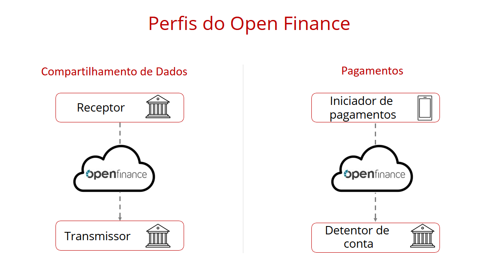

## Perfis de Participação

As Instituições financeiras podem participar do Open Finance Brasil cumprindo vários papéis específicos, aqui denominados Perfis de Participação. Algumas Instituições financeiras são obrigadas a participar com determinados perfis, mas todas as Instituições podem, voluntariamente, exercer todos os perfis existentes.

Os perfis exercidos pelas Instituições financeiras podem ser divididos nos dois ecossistemas existentes: Compartilhamento de Dados e Pagamentos. Em cada um deles existe uma parte ativa (que é quem inicia uma ação) e uma parte passiva, que responde à ação disparada pela parte ativa.

### No ecossistema de Dados

- Transmissora de Dados - Parte passiva.
- Receptora de Dados - Parte ativa.

### No ecossistema de Pagamentos

- Detentora de Conta - Parte passiva.
- Iniciadora de Transação de Pagamento (ITP) - Parte ativa.

### Plataforma Opus Open Finance

A Plataforma Opus Open Finance oferece uma solução completa para atender aos requisitos necessários a todos os perfis de participação do *Open Finance Brasil*.
