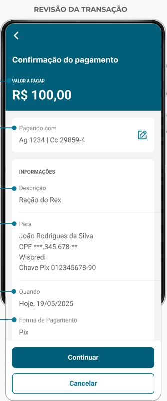
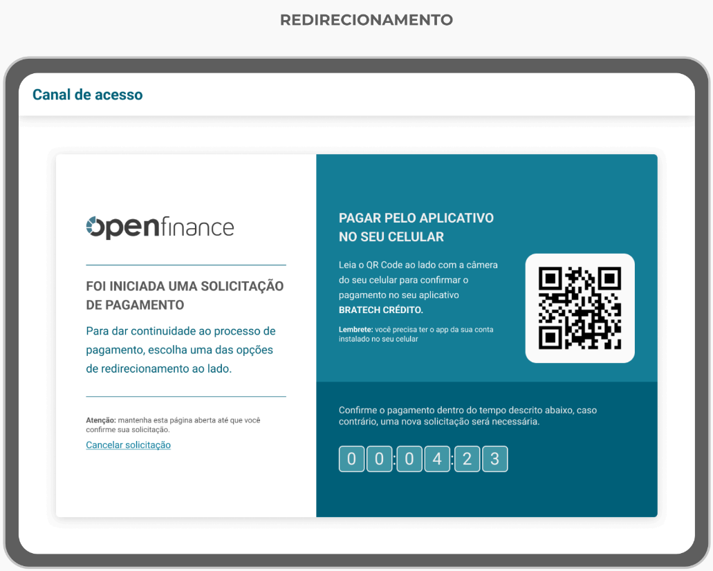

<!-- PREVIEW da separação (item #3) — revisar antes de aplicar -->
> _Página A — Visão geral: o que a solução resolve, o que você desenvolve, e as telas de aceite._

## Introdução

Esta página foi elaborada para apoiar usuários que estão utilizando a ferramenta pela primeira vez. Aqui, é possível encontrar instruções passo a passo que tornarão o uso do software mais simples, intuitivo e eficiente, ajudando a explorar todo o seu potencial desde o início, e entender o funcionamento da solução.

---

## Itens resolvidos pela nossa solução

Aqui estão os principais elementos que nossa solução oferece:

- **Exibição e confirmação do consentimento:** A confirmação faz parte da solução, minimizando o esforço técnico;

- **Tela de Handoff:** A tela de Handoff já está implementada na nossa solução, poupando esse esforço caso você, cliente, só possua uma solução app;

- **Área de gestão completa:** Nossa solução inclui um painel centralizado para a gestão dos consentimentos, pagamentos e vínculos;

- **Listagem e detalhes dos consentimentos:** Os consentimentos transmitidos são listados, com detalhes completos disponíveis;

- **Revogação de consentimentos:** Implementamos uma forma simples para que os usuários possam revogar consentimentos, pagamentos ou vínculos quando necessário;

- **Gestão de consentimentos:** Oferecemos uma interface unificada para gestão integrada das funcionalidades do Open Finance.

---

## Itens que você precisará desenvolver

Embora nossa solução implemente todas as exigências regulatórias, alguns elementos exigem personalização ou integração específica da sua parte:

- **Autenticação do usuário:** É necessário que você implemente um método seguro para autenticação dos usuários, garantindo conformidade com as políticas de segurança;

- **Telas de autenticação e senha de transação:** A personalização do branding visual precisará ser adaptada de acordo com suas preferências e identidade visual;

- **Senha de transação:** Dependendo do seu modelo de negócio, você pode precisar adicionar uma senha de transação para aprovações de consentimentos;

- **Área de gestão de consentimentos:** Você precisará desenvolver um mecanismo que redirecione o usuário do seu aplicativo/site diretamente para a área de gestão de forma segura e já autenticada. Exemplo: Uma opção no Menu Principal chamada “Open Finance” que ao ser selecionada pelo usuário, redirecione-o para a nossa área de gestão dos seus consentimentos;

- **Implementação do aceite de consentimento Web e/ou App:** Você precisará ajustar seus sites/aplicativos para receber (em webview) as telas que nossa solução implementa.

---

## O que a nossa solução implementa

Uma vez que o usuário efetue o login através da sua aplicação, ele terá acesso a uma série de telas em conformidade com o que há de mais atualizado na regulação do Banco Central.  

Nosso objetivo é assegurar que, ao longo de toda a jornada de Open Finance, os clientes tenham **controle total** sobre seus **dados** e as **permissões de compartilhamento**, gerenciando de maneira simples e eficiente suas contas vinculadas e consentimentos.

Após a autenticação do usuário, este terá acesso as telas descritas:

### Telas de Aceite de Consentimento

**Observação:** As telas apresentadas nesta seção estão contidas no Guia de Experiência do Usuário, Item 02 (Compartilhamento de dados), Item 03 (Iniciação de pagamentos), Item 04 (Jornadas alternativas de iniciação de pagamento – Jornada sem Redirecionamento – Etapa 3). Mais detalhes [no link](https://guia-de-ux-open-finance-brasil.scroll.site/guia-de-experi-ncia-open-finance-brasil/v.22.00.01).

Essas telas estão associadas ao processo de confirmação de identidade do usuário e de consentimento, garantindo que o cliente tenha controle sobre suas permissões no Open Finance. Abaixo estão as telas que fazem parte dessa etapa:

#### Tela 1: Revisão de Consentimento

- O usuário pode revisar o consentimento de compartilhamento de dados, pagamentos e vínculos de contas antes de finalizar o processo. A tela mostra os dados autorizados e as finalidades.

#### Tela 2: Confirmação de Consentimento

- Informa ao usuário as informações coletadas na etapa anterior, detalhando as permissões concedidas e fornecendo um resumo do que está sendo autorizado.

#### Tela 3: Handoff  

- Informa ao usuário que sua jornada deverá seguir pelo app do cliente, apresentando um QRCode que deve ser escaneado pela câmera do celular. Esta tela será exibida somente para clientes que só possuem a opção app, sem internet banking.

Essas telas foram projetadas para fornecer uma experiência segura e amigável, onde o usuário tem controle total sobre suas permissões e vínculos no Open Finance.

Utilizando nossa solução de consentimento compartilhado, sua equipe pode economizar tempo no desenvolvimento e assegurar que todas as exigências regulatórias sejam atendidas. Nossa plataforma oferece uma implementação fácil e em conformidade com o Open Finance Brasil, permitindo que você foque em desenvolver funcionalidades específicas, enquanto nossa solução cuida do resto.

---

